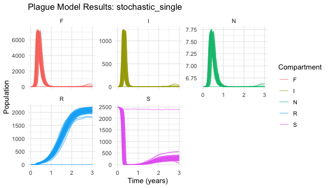
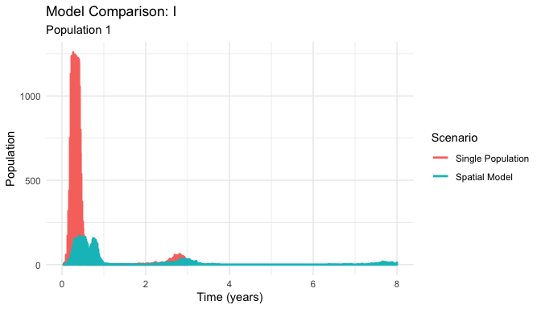
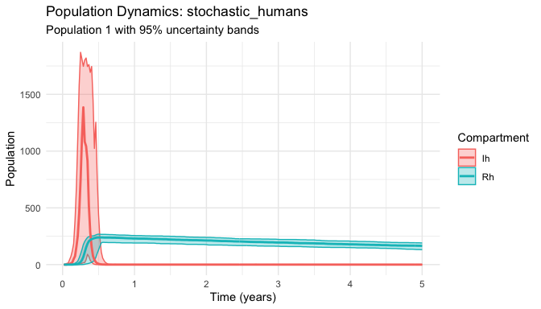

<!-- README.md is generated from README.Rmd. Please edit that file -->

# yersinia 

<!-- badges: start -->

[](https://lifecycle.r-lib.org/articles/stages.html#experimental)
[](https://github.com/flmnh-ai/plague-model/actions)
<!-- badges: end -->

> **Stochastic plague transmission modeling for epidemiological research
> and public health applications**

The `yersinia` package provides a comprehensive toolkit for modeling
plague transmission dynamics using realistic stochastic simulation.
Built on the robust `odin.dust` framework, it captures the complex
biological processes that drive plague outbreaks, including demographic
stochasticity, spatial spread, and multi-host transmission cycles.

## Why Stochastic Models?

Traditional deterministic plague models fail to capture: - **Small
population effects** where random events drive extinction/persistence -
**Spatial heterogeneity** in transmission and population structure -
**Uncertainty quantification** essential for risk assessment -
**Realistic outbreak variability** observed in natural systems

## Key Features

- 🎲 **Stochastic simulation** with demographic noise and realistic
  population dynamics
- 🗺️ **Spatial metapopulations** with migration and local adaptation
- 📚 **Evidence-based parameters** from historical and contemporary
  plague research  
- 🏥 **Multi-host dynamics** including rat-flea-human transmission
  cycles
- 📊 **Professional analysis** tools for R₀, outbreak metrics, and
  spatial patterns
- 📈 **Publication-ready plotting** with uncertainty quantification

## Installation

Install the development version from GitHub:

``` r
# install.packages("pak")
pak::pak("flmnh-ai/plague-model")
```

## Quick Start

``` r
library(yersinia)
set.seed(42)

# Run a basic plague model
results <- run_plague_model(
  scenario = "keeling-gilligan",  # Keeling & Gilligan (2000) parameters
  years = 3,
  n_particles = 50              # 50 stochastic replicates
)

# Built-in plotting with uncertainty bands  
plot(results)
```



## Core Capabilities

### Evidence-Based Parameter Sets

``` r
# Load curated parameter sets from the literature
params <- load_scenario("historical")  # Medieval Black Death parameters
print(params)
#> 🦠 Plague Scenario (historical)
#> 📄  Biological parameters for historical plague outbreaks (14th-17th centuries) 
#> 📚 Source:  Historical analysis and paleoepidemiology 
#> 
#> 🐀 Rat Population Parameters:
#>   r_r    =    6.000  # Rat population growth rate (per year)
#>   d_r    =    0.150  # Natural death rate of rats (per year)
#>   p      =    0.980  # Probability of inherited resistance
#> 
#> 🦟 Flea Parameters:
#>   K_f    =    5.000  # Flea carrying capacity per rat
#>   r_f    =   15.000  # Flea reproduction rate (per year)
#>   d_f    =    8.000  # Death rate of free fleas (per year)
#>   a      =    0.003  # Flea search efficiency
#> 
#> 🔬 Disease Parameters:
#>   beta_r =    6.000  # Rat infection rate from fleas (per year)
#>   m_r    =   25.000  # Infected rat mortality rate (per year)
#>   g_r    =    0.010  # Probability rat survives infection
#> 
#> 👤 Human Parameters:
#>   r_h    =    0.030  # Human population growth rate (per year)
#>   d_h    =    0.080  # Natural death rate of humans (per year)
#>   beta_h =    0.015  # Human infection rate from fleas
#>   m_h    =   35.000  # Human recovery rate (per year)
#>   g_h    =    0.050  # Probability human survives infection
#> 
#> ⚙️  Other Parameters:
#>   mu_r   =    0.020  # Rat movement rate (per year)
#>   mu_f   =    0.005  # Flea movement rate (per year)
#> 
#> 📈 Basic Reproduction Number (R₀):  596.092 ✅ (Disease can spread)

# Calculate basic reproduction number
R0 <- calculate_R0(params)
cat("Historical R₀:", round(R0, 2))
#> Historical R₀: 596.09
```

### Professional Analysis Tools

``` r
# Comprehensive outbreak analysis
outbreak_stats <- results |>
  calculate_outbreak_metrics(compartment = "I") |>
  summarize_outbreak_metrics()

print(outbreak_stats[c("outbreak_probability", "mean_peak", "mean_duration")])
#> # A tibble: 1 × 3
#>   outbreak_probability mean_peak mean_duration
#>                  <dbl>     <dbl>         <dbl>
#> 1                    1     1185.         0.849
```

### Spatial Modeling

``` r
# Multi-population spatial model
spatial_results <- run_plague_model(
  scenario = "modern-estimates",
  npop = 16,                    # 4x4 spatial grid
  K_r = 8000,                   # Total rat carrying capacity
  years = 8,
  n_particles = 30
)

# Compare single vs spatial dynamics  
plot_comparison(
  list("Single Population" = results, "Spatial Model" = spatial_results),
  compartment = "I"
)
```



### Historical Applications

``` r
# Model Black Death scenario
black_death <- run_plague_model(
  scenario = "historical",
  include_humans = TRUE,        # Include human transmission
  years = 5,
  n_particles = 40
)

# Focus on human epidemic dynamics
plot_dynamics(black_death, compartments = c("Ih", "Rh"))
```



## Model Types

| Model | Description | Use Case |
|----|----|----|
| **Single Population** | Basic rat-flea dynamics | Parameter exploration, R₀ analysis |
| **Spatial** | Multi-population with migration | Landscape epidemiology, spatial spread |
| **Multi-host** | Rat-flea-human transmission | Epidemiological studies, intervention planning |
| **Seasonal** | Environmental forcing | Climate effects, annual cycles |

## Parameter Sets

| Scenario | Source | Description | R₀ |
|----|----|----|----|
| `"defaults"` | Package defaults | Baseline parameters | 581.66 |
| `"keeling-gilligan"` | Keeling & Gilligan (2000) | Foundational metapopulation model | 581.66 |
| `"modern-estimates"` | Contemporary research | Current parameter estimates | 684.93 |
| `"historical"` | Medieval records | Black Death era parameters | 596.09 |

## Getting Help

- 📖 **Comprehensive tutorial**: `vignette("yersinia-intro")`
- 🔍 **Function reference**: `help(package = "yersinia")`
- 🎯 **Main modeling function**: `?run_plague_model`
- 📐 **Deterministic comparisons**:
  `vignette("reference-deterministic-models")`

## Citation

If you use `yersinia` in your research, please cite:

``` r
citation("yersinia")
```

## Related Work

- **Keeling & Gilligan (2000)**: Foundational plague metapopulation
  model ([Nature](https://doi.org/10.1038/35038564))
- **odin.dust framework**: Stochastic compartmental modeling
  ([CRAN](https://cran.r-project.org/package=odin.dust))

------------------------------------------------------------------------

**License**: MIT \| **Bugs**: [GitHub
Issues](https://github.com/flmnh-ai/plague-model/issues)
